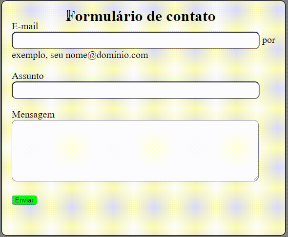

# **Índice**

* [Projeto escrita do README](#projeto-escrita-do-readme)
* [Descrição](#descri%C3%A7%C3%A3o)
* [Tecnologias utilizadas](#tecnologias-utilizadas)
* [Fontes utilizadas](#fontes-utilizadas)
* [Autores](#autores)

# **Funcionalidades**

* [Form](#form)
* [Label](#label)
* [Input](#input)
* [Span](#span)
* [Textarea](#textarea)
* [Button](#button)

# ***Projeto escrita do README***



# *Descrição*

Projeto onde deveríamos criar um formulário de contato.

# *Tecnologias utilizadas*

Foram utilizadas as tecnologias de HTML e CSS.

# *Fontes utilizadas*

gg.gg/form-element

# *Autores*

Deivid Lucas

# ```<Form>```
O elemento de HTML &lt;form&gt; representa uma seção do documento contento controles interativos para envio de informações.

# ```<Label>```
O elemento de HTML &lt;label&gt; reprsenta uma legenda para um item em uma interface de usuário.

# ```<Input>```
O elemento de HTML &lt;input&gt; é usado para criar controles interativos para formulários baseados na web para aceitar dados do usuário; uma ampla variedade de tipos de dados entrada e widgets de controle estão disponíveis, dependendo do dispositivo e do agente do usuário. O elemento &lt;input&gt; é um dos mais poderosos e complexos de todo o HTML devido ao grande número de combinações de tipos de atributos de entrada.

## ```<Input> types```
O modo como um &lt;input&gt; funciona varia consideravelmente dependendo do valor de seu atributo type, portanto, os diferentes tipos são abordados em suas próprias páginas de referência seperadas. Caso este atributo não seja especificado, o tipo padrão adotado é texto.

# ```<Span>```
O elemento HTML &lt;span&gt; é um contêiner embutido genérico para frasear conteúdo, que não representa nada inerentemente. Ele pode ser usado para agrupar elementos para fins de estilo (usando os atributos class ou id) ou porque eles compartilham valores de atributos, como lang. Deve ser usado somente quando nenhum outro elemento semântico for apropriado. &lt;span&gt; é muito parecido com um elemento &lt;div&gt;, mas &lt;div&gt; é um elemento de nível de bloco, enquanto &lt;span&gt; é um elemento de nível embutido.

# ```<Textarea>```
O elemento HTML &lt;textarea&gt; representa um controle de edição de texto simples de múltiplas linhas, útil quando você deseja permitir que os usuários insiram uma quantidade considerável de texto em formato livre, por exemplo, um comentário em um formulário de revisão ou feedback.

# ```<Button>```
O elemento HTML &lt;button&gt; é um elemento interativo ativado por um usuário com mouse, teclado, dedo, comando de voz ou outra tecnologia assistiva. Uma vez ativado, ele executa uma ação, como enviar um formulário ou abrir uma caixa de diálogo.
